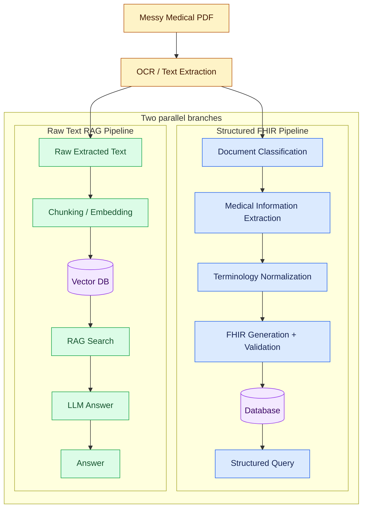

# Canonical Medical FHIR

Local pipeline: React -> FastAPI -> PDF extraction/OCR -> two parallel branches: structured FHIR processing and raw-text RAG search.

## Architecture



Both branches originate from the same OCR / Text Extraction output. The FHIR branch creates structured, validated medical records in the Database for structured queries. The raw-text RAG branch sends extracted text directly toward the Vector DB through Chunking / Embedding; the Vector DB supports semantic RAG Search, and the LLM generates the final natural-language Answer.

## Docker (recommended)
Install Docker Desktop, then from this folder:

```bash
docker compose up --build
```

Open `http://localhost:5173`. API docs: `http://localhost:8000/docs`. HAPI: `http://localhost:8080/fhir/metadata`.

## MongoDB storage

Each successful upload stores its raw extracted text, page classification, normalized medical data, generated FHIR resources, validation results, and provenance in the `records` collection. Its RAG vector is stored separately in `record_vectors`.

With Docker Compose, connect through MongoDB Compass or `mongosh` at `mongodb://127.0.0.1:27018`, database `canonical_medical_fhir`. Docker persists this data in its named `mongo_data` volume; it is not written to the project's `mongodb-data` folder. Port `27018` avoids conflicts with a locally installed MongoDB service on `27017`.

## RAG search

When a PDF is processed, the canonical record is saved in MongoDB and a searchable text projection plus embedding is written to the `record_vectors` collection. A question submitted through the search box retrieves the closest stored records, then sends that context to the configured OpenAI-compatible chat model. The API returns the generated `answer`, retrieved `sources`, and the original `results` list.

Set these values in `backend/.env` to enable embeddings and LLM answers:

```env
LLM_API_KEY=your-key
LLM_BASE_URL=https://generativelanguage.googleapis.com/v1beta/openai/
LLM_MODEL=gemini-3.6-flash
EMBEDDING_MODEL=text-embedding-3-small
RAG_TOP_K=5
LLM_TIMEOUT_SECONDS=45
```

Without `LLM_API_KEY`, the app uses a local deterministic embedding and an extractive fallback answer, so the search workflow remains available for local development.

## Native backend
Requires MongoDB, Tesseract OCR and Poppler installed locally. In `backend`:

```bash
python -m venv .venv
.venv\\Scripts\\activate
pip install -r requirements.txt
uvicorn app.main:app --reload
```

In another terminal, `cd frontend`, `npm install`, `npm run dev`.

## Vercel deployment

`vercel.json` deploys the Vite frontend and FastAPI backend as two Vercel Services in one project. Requests to `/api/*` are routed to FastAPI and all other requests go to the frontend, so no production `VITE_API_URL` is required.

Import the repository into Vercel with this folder as its root directory, then set these backend environment variables in the Vercel project:

```env
MONGODB_URL=your-mongodb-atlas-connection-string
MONGODB_DB=canonical_medical_fhir
HAPI_FHIR_URL=https://your-public-hapi-fhir-host/fhir
LLM_API_KEY=your-key
LLM_BASE_URL=https://api.openai.com/v1
LLM_MODEL=gpt-4o-mini
```

`backend/.env` is intentionally excluded from the deployment. Uploaded PDFs use temporary `/tmp` storage in Vercel Functions; records are persisted in MongoDB. The Docker-only Tesseract and Poppler packages are not available in a standard Vercel Function, so scanned PDFs need an external OCR service or a backend deployed on a container host.

## Notes
This is an assessment/demo pipeline, not a clinical decision system. Extraction uses deterministic heuristics; production medical NLP should add stronger terminology services, confidence scores, human review, security, audit controls, and robust FHIR profile validation.
